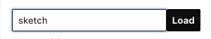
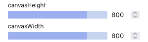

# p5-sketch-gui

> Create [p5](https://p5js.org) sketch thanks to a simple graphical user interface that adds controls for any variables.

⚠️ It is a personal project. I have created it quickly enough to meet my needs. It will be enhanced over the time.

## Documentation

### Start the application

```sh
# Use the project node version
nvm use

# Install dependencies
npm install

# Start the local web server
npm start
```

### Create a sketch file

Create a JavaScript file in the `src/sketches` folder. You can duplicate the sample `sketch.js` that exports a simple sketch and controls to customize the canvas size.

This file should export at least a named function called `sketch`. The exported `controls` constant is not mandatory but, well, this is the main goal of the application!

Go to `http://localhost:3000/` and type the name of your file in the dedicated input to load it:




### Add controls

Export a `controls` object with simple key/value pairs:

```js
export const controls = {
  canvasWidth : 800,
  canvasHeight : 800
};
```

This will generate a menu with two sliders:



Instead of simple key/value pairs, you can use key/object pairs to have more control over the generated menu:

```js
export const controls = {
  canvasWidth : {
    value : 800,
    min : 400,
    max : 1200
  },
  canvasHeight : {
    value : 800,
    min : 400,
    max : 1200
  }
};
```

### Add sketch

Export a `sketch` function. This function takes two arguments:

- `p5`: the `p5` instance
- `state`: object with the updated value of your variables

```js
export function sketch(p5, state) {
  const { canvasWidth, canvasHeight } = state;

  p5.setup = () => {
    p5.createCanvas(canvasWidth, canvasHeight);
    p5.background(255);
  };

  p5.draw = () => {
    p5.rect(20, 20, 300, 300);
  };
}
```

⚠️ For now, only the p5 instance mode is available.